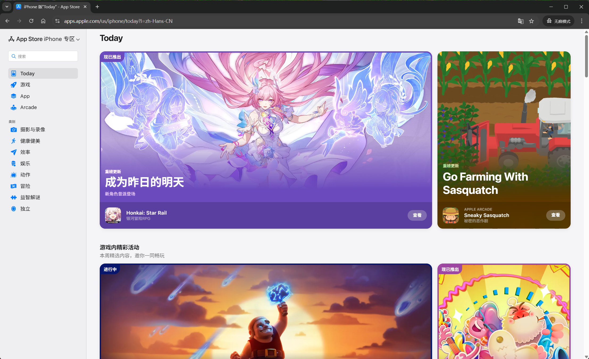
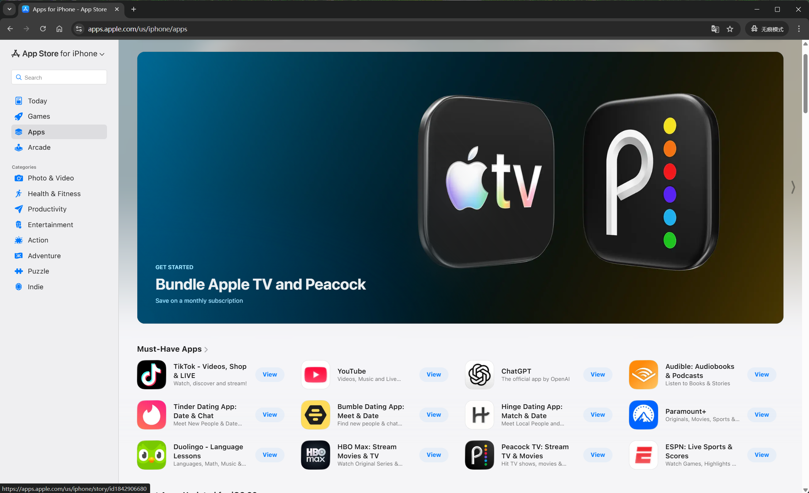
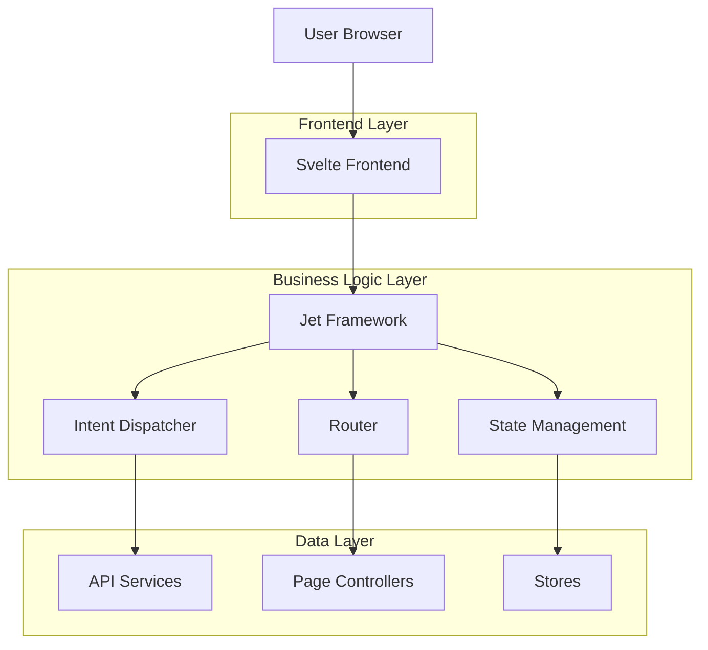

# App Store 前端项目代码学习文档
## 运行效果



## 1. 项目概述

### 业务背景
本项目是 Apple App Store 的前端应用，提供 iOS、macOS、watchOS 等平台的应用商店浏览、搜索、购买功能。作为全球最大的应用分发平台之一，该项目展现了现代前端开发的最高标准。

### 技术定位
- **高性能**: 首屏加载时间 < 2秒，交互响应 < 100ms
- **无障碍**: 完整的 WCAG 2.1 标准支持
- **国际化**: 支持 40+ 种语言和地区
- **响应式**: 适配从手机到桌面的全平台设备

### 技术栈版本
```markdown
- Frontend: Svelte 3.x + TypeScript 4.x
- Build Tool: Vite/Rollup
- State Management: Jet Framework + Svelte Stores
- Styling: SCSS + CSS Custom Properties
- Testing: Jest + Playwright
- Package Manager: npm/yarn
```

### 整体架构图


## 2. 核心目录结构

```markdown
├── src/                          # 主应用源码
│   ├── App.svelte               # 根组件，全局布局和状态管理
│   ├── bootstrap.ts             # 应用引导初始化
│   ├── browser.ts               # 浏览器端特定逻辑
│   ├── components/              # 业务组件
│   │   ├── navigation/         # 导航相关组件
│   │   ├── pages/              # 页面级组件
│   │   ├── structure/          # 结构组件（Header/Footer）
│   │   └── hero/               # Hero区域组件
│   ├── config/                # 配置文件
│   │   ├── build.ts            # 构建相关配置
│   │   ├── components/         # 组件配置
│   │   └── errorkit.ts         # 错误处理配置
│   ├── constants/             # 常量定义
│   ├── context/               # Svelte上下文
│   │   ├── accessibility-layout.ts  # 无障碍布局
│   │   └── today-card-layout.ts     # 今日卡片布局
│   ├── jet/                   # Jet框架核心
│   │   ├── bootstrap.ts       # Jet运行时引导
│   │   ├── jet.ts             # Jet主类
│   │   ├── intents/          # 意图定义
│   │   ├── models/            # 数据模型
│   │   └── dependencies/      # 依赖注入
│   ├── sf-symbols/            # SF Symbols图标
│   ├── stores/                # Svelte状态管理
│   │   ├── i18n.ts            # 国际化
│   │   ├── modalPage.ts       # 模态页面
│   │   └── carousel-media-style.ts # 轮播样式
│   └── utils/                 # 工具函数
├── shared/                    # 共享模块
│   ├── components/            # 可复用组件库
│   ├── localization/          # 本地化资源
│   ├── logger/               # 日志系统
│   └── utils/                # 共享工具
├── assets/                    # 构建产物
├── api/                       # API相关
└── us/                        # 地区特定代码
```

## 3. 模块功能矩阵

| 模块路径 | 功能职责 | 关联依赖 | 典型调用示例 |
|----------|----------|----------|--------------|
| `src/App.svelte` | 应用根组件，负责全局布局和页面分发 | Jet, PageResolver, Navigation | 初始化应用布局和路由 |
| `src/bootstrap.ts` | 应用引导，初始化Jet框架和国际化 | Jet, i18n, context | `bootstrap({loggerFactory, initialUrl})` |
| `src/jet/jet.ts` | Jet框架核心，提供意图分发和状态管理 | AppStoreRuntime, IntentDispatcher | `jet.dispatch(intent)` |
| `src/stores/i18n.ts` | 国际化状态管理 | I18N, readable store | `getI18n()`获取翻译函数 |
| `src/components/Grid.svelte` | 响应式网格布局组件 | getGridVars, CSS Grid | `<Grid items={data} gridType="shelf">` |
| `src/utils/media-queries.ts` | 响应式断点管理 | ArtworkConfig, media stores | `$mediaQueries === 'large'` |
| `src/context/accessibility-layout.ts` | 无障碍布局上下文 | WeakMap, Svelte context | `setAccessibilityLayoutContext(page)` |
| `shared/components/buttons/Button.svelte` | 基础按钮组件 | SCSS, event dispatcher | `<Button buttonStyle="primary">Click</Button>` |
| `src/config/build.ts` | 构建版本管理 | process.env | `BUILD`常量 |
| `src/jet/bootstrap.ts` | Jet运行时初始化 | IntentControllers, Router | `bootstrap(dependencies)` |

## 4. 关键文件说明

### `/src/App.svelte`
```svelte
<!-- 功能：应用根组件，负责全局布局、导航和页面分发 -->
<!-- 技术点： -->
<!-- - 使用Svelte的reactive声明实现响应式数据流 -->
<!-- - 支持SSR/CSR双模式渲染 -->
<!-- - 集成错误边界处理 -->
<!-- - CSS Grid实现响应式布局 -->

<script lang="ts">
    import { onMount } from 'svelte';
    import { getJet } from '~/jet';
    import { makeErrorPageIntent } from '~/jet/intents/error-page-intent-controller';
    
    // 处理页面Promise拒绝，转换为错误页面
    function transformRejectionIntoErrorPage(page: Promise<Page> | Page): Promise<Page> | Page {
        if (!(page instanceof Promise)) {
            return page;
        }
        return (async (): Promise<Page> => {
            try {
                return await page;
            } catch (error) {
                return jet.dispatch(makeErrorPageIntent({ error }));
            }
        })();
    }
</script>
```

### `/src/bootstrap.ts`
```typescript
// 功能：应用引导初始化，设置Jet框架和国际化
// 技术点：
// - 异步初始化Jet运行时
// - 集成i18n国际化
// - 路由初始化和意图预取
// - 依赖注入配置

export async function bootstrap({
    loggerFactory,
    initialUrl,
    fetch,
    prefetchedIntents,
    featuresCallbacks,
}: BootstrapOptions): Promise<BootstrapResult> {
    const jet = Jet.load({
        loggerFactory,
        context,
        fetch,
        prefetchedIntents,
        featuresCallbacks,
    });

    const routing = await jet.routeUrl(initialUrl);
    const i18nStore = await setupI18n(context, loggerFactory, language);
    
    return { context, jet, initialAction, intent, storefront, language, i18n: i18nStore };
}
```

### `/src/jet/jet.ts`
```typescript
// 功能：Jet框架核心，提供意图分发和状态管理
// 技术点：
// - 意图驱动架构(Intent-based Architecture)
// - 预取意图缓存机制
// - 集成指标收集
// - 错误处理和重试机制

export class Jet {
    private readonly prefetchedIntents: PrefetchedIntents;
    
    async dispatch<I extends Intent<unknown>>(intent: I): Promise<IntentReturnType<I>> {
        const data = this.prefetchedIntents.get(intent);
        if (data) {
            return data; // 使用预取的数据避免重复请求
        }
        return this.runtime.dispatch(intent);
    }
}
```

### `/src/stores/i18n.ts`
```typescript
// 功能：国际化状态管理
// 技术点：
// - Svelte readable store模式
// - 动态导入翻译文件
// - 支持开发模式下的本地化key显示
// - 错误边界处理

export async function setup(context: Map<string, unknown>, loggerFactory: LoggerFactory, locale: Locale): Promise<I18N> {
    const translations = await getTranslations(log, locale);
    const i18n = new I18N(log, locale, translations, alwaysShowScreamers);
    const store = readable(i18n);
    context.set(CONTEXT_NAME, store);
    return i18n;
}

function importLocale(locale: Locale): Promise<IDynamicImportJSON> {
    return import(`../../tmp/locales/${locale}/translations.json`);
}
```

### `/src/components/Grid.svelte`
```svelte
<!-- 功能：响应式网格布局组件 -->
<!-- 技术点： -->
<!-- - CSS Grid实现响应式布局 -->
<!-- - CSS自定义属性动态样式 -->
<!-- - 泛型组件支持任意数据类型 -->
<!-- - 媒体查询断点系统集成 -->

<script lang="ts" generics="T">
    export let items: T[] = [];
    export let gridType: GridType;
    
    $: style = getGridVars(gridType);
</script>

<ul {style} class="grid" data-test-id="grid">
    {#each items as item}
        <li>
            <slot {item} />
        </li>
    {/each}
</ul>

<style lang="scss">
    .grid {
        display: grid;
        width: 100%;
        
        @each $viewport in ('xsmall', 'small', 'medium', 'large', 'xlarge') {
            @media (--range-#{$viewport}-only) {
                grid-template-columns: repeat(var(--grid-#{$viewport}), 1fr);
            }
        }
    }
</style>
```

### `/src/context/accessibility-layout.ts`
```typescript
// 功能：无障碍布局上下文管理
// 技术点：
// - WeakMap存储组件级配置
// - Svelte context API跨组件通信
// - 动态布局计算
// - 可访问性相关的间距和排序

export function setAccessibilityLayoutContext(page: { shelves: Shelf[] }) {
    const store: AccessibilityLayoutStore = new WeakMap();
    
    for (let i = 0; i < page.shelves.length; i++) {
        const shelf = page.shelves[i];
        if (!isTargetAccessibilityShelf(shelf)) continue;
        
        const nextShelf = page.shelves[i + 1];
        const hasAccessibilityNext = nextShelf && isAccessibilityRelated(nextShelf);
        
        store.set(shelf, {
            withBottomPadding: !hasAccessibilityNext,
        });
    }
    
    setContext<AccessibilityLayoutStoreContext>(ACCESSIBILITY_LAYOUT_CONTEXT_ID, store);
}
```

### `/shared/components/buttons/Button.svelte`
```svelte
<!-- 功能：基础按钮组件，支持多种样式和交互 -->
<!-- 技术点： -->
<!-- - 插槽支持图标和文本组合 -->
<!-- - 完整的键盘交互支持 -->
<!-- - CSS自定义属性主题化 -->
<!-- - TypeScript类型安全 -->

<script lang="ts">
    type ButtonType = 'buttonA' | 'buttonB' | 'buttonD' | 'alertButton' | 'pillButton' | 'textButton';
    
    export let buttonStyle: string | null = null;
    export let makeFocused = false;
    export let ariaLabel: string | null = null;
    export let disabled = false;
    
    function handleKeyUp(e: KeyboardEvent) {
        if (e.key === 'Enter' || e.key === 'Escape') {
            handleButtonClick();
        }
    }
</script>

<div class="button" class:primary={buttonType === 'buttonA'}>
    <button
        on:click={handleButtonClick}
        aria-label={ariaLabel}
        on:keyup={handleKeyUp}
        {disabled}
    >
        {#if $$slots['icon-before']}
            <slot name="icon-before" />
        {/if}
        <slot />
        {#if $$slots['icon-after']}
            <slot name="icon-after" />
        {/if}
    </button>
</div>
```

### `/src/utils/media-queries.ts`
```typescript
// 功能：响应式断点管理
// 技术点：
// - 基于ArtworkConfig的断点配置
// - Svelte store实现响应式
// - 考虑侧边栏宽度的偏移计算
// - 自动媒体查询条件生成

const { BREAKPOINTS } = ArtworkConfig.get();

const mediaQueryStore = buildMediaQueryStore(
    'medium',
    getMediaConditions(BREAKPOINTS, { offset: 260 }),
);

export default mediaQueryStore;
```

### `/src/config/build.ts`
```typescript
// 功能：构建版本管理
// 技术点：
// - 环境变量注入
// - 版本追踪和Sentry集成
// - 构建时优化
// - 缓存失效策略

export const BUILD = process.env.VERSION as string;
```

### `/src/jet/bootstrap.ts`
```typescript
// 功能：Jet运行时初始化，注册所有意图控制器
// 技术点：
// - 控制器注册和路由映射
// - 依赖注入配置
// - 意图分发器初始化
// - 错误页面控制器优先级处理

function makeIntentDispatcher(): AppStoreIntentDispatcher {
    const intentDispatcher = new AppStoreIntentDispatcher();
    
    // 注册所有页面控制器
    intentDispatcher.register(ProductPageIntentController);
    intentDispatcher.register(SearchResultsPageIntentController);
    intentDispatcher.register(RoutableTodayPageIntentController);
    // ... 更多控制器
    
    return intentDispatcher;
}
```

## 5. 学习路线建议

### 新人应优先阅读的3个核心模块

1. **Jet框架核心** (`src/jet/`)
   - 理解意图驱动架构的基本概念
   - 掌握路由和状态管理的实现方式
   - 学习依赖注入和控制器模式

2. **组件系统** (`src/components/` 和 `shared/components/`)
   - 熟悉基础组件的设计模式
   - 学习响应式布局和CSS Grid的使用
   - 掌握Svelte组件的生命周期和事件处理

3. **国际化系统** (`src/stores/i18n.ts`)
   - 理解多语言支持的实现机制
   - 学习动态导入和异步加载
   - 掌握store模式的状态管理

### 需要重点理解的5个设计模式

1. **意图驱动架构 (Intent-Driven Architecture)**
   - 将用户操作抽象为业务意图
   - 通过意图分发器统一处理业务逻辑
   - 实现前后端解耦和更好的可测试性

2. **依赖注入 (Dependency Injection)**
   - 通过ObjectGraph管理依赖关系
   - 实现更好的模块解耦和测试性
   - 支持运行时依赖替换

3. **观察者模式 (Observer Pattern)**
   - Svelte store的实现机制
   - 响应式数据流的传播
   - 自动订阅和取消订阅

4. **策略模式 (Strategy Pattern)**
   - 不同页面控制器的实现
   - 可插拔的组件行为
   - 运行时策略选择

5. **工厂模式 (Factory Pattern)**
   - Jet实例的创建和配置
   - 控制器和服务的实例化
   - 环境相关的对象创建

### 调试技巧

1. **启用DEBUG模式**
   ```typescript
   // 在浏览器控制台中
   window.__DEBUG = true;
   window.__JET_DEBUG = true;
   ```

2. **查看Jet意图流**
   ```typescript
   // 监听意图分发
   jet.addIntentListener((intent) => {
       console.log('Intent dispatched:', intent);
   });
   ```

3. **检查Store状态**
   ```typescript
   // 在Svelte DevTools中查看store状态
   // 或者手动订阅
   const unsubscribe = store.subscribe(value => {
       console.log('Store value:', value);
   });
   ```

4. **性能分析**
   ```typescript
   // 启用性能监控
   import { metrics } from '~/config/metrics';
   metrics.enablePerformanceMonitoring();
   ```

## 6. 附录

### 项目启动命令

```bash
# 安装依赖
npm install

# 开发模式启动
npm run dev

# 生产构建
npm run build

# 运行测试
npm test

# 代码质量检查
npm run lint
npm run typecheck
```

### 代码规范检查工具配置

**ESLint配置** (`.eslintrc.js`):
```javascript
module.exports = {
    extends: [
        '@apple/eslint-config-applerecommended',
        'plugin:@typescript-eslint/recommended',
        'plugin:svelte/recommended'
    ],
    rules: {
        // 自定义规则
        '@typescript-eslint/explicit-function-return-type': 'error',
        'svelte/no-unused-svelte-ignore': 'error'
    }
};
```

**Prettier配置** (`.prettierrc`):
```json
{
    "tabWidth": 4,
    "singleQuote": true,
    "trailingComma": "all",
    "svelteStrictMode": true
}
```

### 常见问题解决方案

1. **Jet框架初始化失败**
   - 检查依赖注入配置
   - 验证控制器注册顺序
   - 查看浏览器控制台错误信息

2. **国际化加载失败**
   - 检查翻译文件路径
   - 验证locale设置
   - 确认网络连接状态

3. **响应式布局异常**
   - 检查CSS自定义属性定义
   - 验证媒体查询断点配置
   - 确认viewport meta标签

4. **性能问题**
   - 启用代码分割
   - 优化图片加载策略
   - 检查不必要的重渲染

5. **类型错误**
   - 运行 `npm run typecheck`
   - 检查Svelte组件的TypeScript定义
   - 验证store的类型声明

---

*免责声明：本文档基于开源项目代码编写，仅用于技术学习和研究目的。所有代码版权归原作者所有，仅供学习参考。*